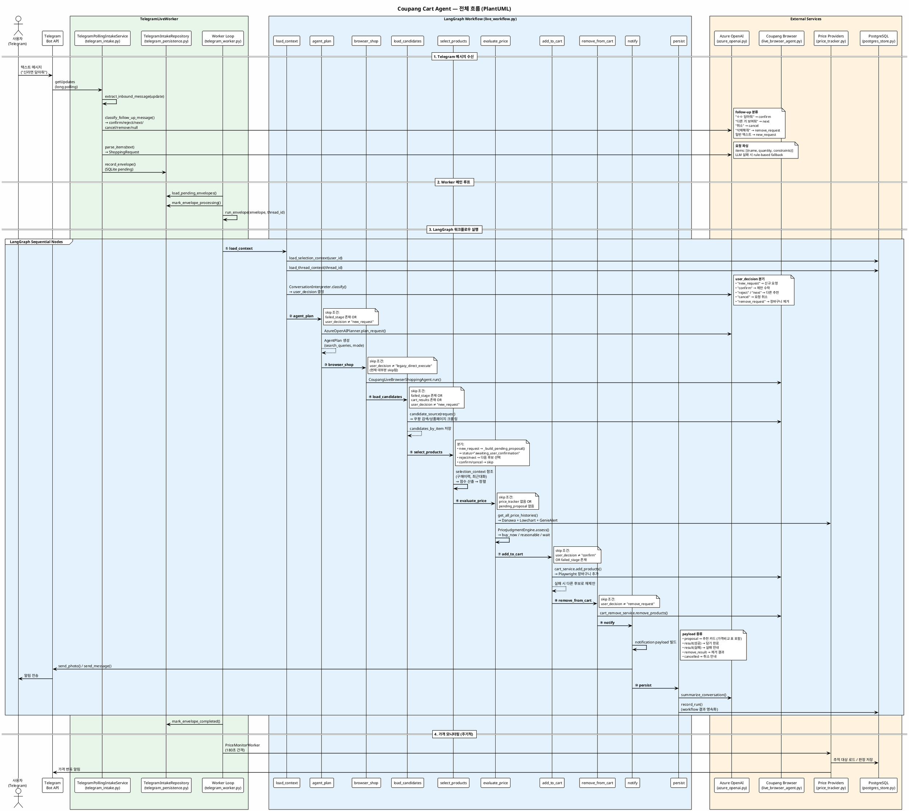

# Coupang Cart Agent

텔레그램 메시지 한 줄로 쿠팡 장바구니에 상품을 담아주는 자동화 에이전트입니다.

```
사용자: "신라면 담아줘"
봇:     [상품 사진]
        농심 신라면 120g, 1개
        810원
        📊 쿠팡 810원 · 다나와 19,800원(최저 3,000원)
        🟢 지금 사는 게 이득

사용자: "ㅇㅇ 담아줘"
봇:     장바구니 담기를 완료했습니다.
        • 농심 신라면 120g, 1개 — 810원 · 1개
```

---

## 한눈에 보는 전체 흐름

```
사용자 (Telegram)
  │  "신라면 담아줘"
  ▼
┌─────────────────────────────────────────────────┐
│  1. Telegram 수신                                │
│     Bot API long-polling → 메시지 파싱(LLM)      │
│     → ShoppingRequest 생성 → SQLite 큐에 저장     │
└──────────────────────┬──────────────────────────┘
                       ▼
┌─────────────────────────────────────────────────┐
│  2. Worker 루프                                  │
│     SQLite에서 pending envelope 로드              │
│     → LangGraph 워크플로우 실행                    │
└──────────────────────┬──────────────────────────┘
                       ▼
┌─────────────────────────────────────────────────┐
│  3. LangGraph 10-Node 워크플로우                  │
│                                                  │
│  ① load_context   — 구매이력/대화맥락 로드         │
│  ② agent_plan     — LLM으로 검색 쿼리 생성        │
│  ③ browser_shop   — (legacy, 대부분 skip)         │
│  ④ load_candidates— 쿠팡 검색 → 후보 상품 수집     │
│  ⑤ select_products— 점수 기반 최적 상품 선택       │
│  ⑥ evaluate_price — 다나와/로우차트/지니얼럿 비교   │
│  ⑦ add_to_cart    — 확인 시 장바구니 추가          │
│  ⑧ remove_from_cart— 삭제 요청 시 장바구니 제거    │
│  ⑨ notify         — Telegram 알림 (사진+가격비교)  │
│  ⑩ persist        — PostgreSQL 결과 저장          │
└──────────────────────┬──────────────────────────┘
                       ▼
               사용자에게 결과 전달
```

### 대화 흐름 (Proposal-first UX)

에이전트는 바로 장바구니에 담지 않고 **먼저 추천안을 보여주고 사용자 확인을 받습니다.**

| 사용자 입력 | 에이전트 동작 |
|---|---|
| `신라면 담아줘` | 쿠팡 검색 → 최적 상품 추천 (사진 + 가격 비교 표) |
| `ㅇㅇ 담아줘` | 추천 수락 → 실제 장바구니에 담기 |
| `다른 거 보여줘` | 다음 후보 상품으로 교체 제안 |
| `취소` | 현재 요청 취소 |
| `빼줘` / `삭제해줘` | 장바구니에서 상품 제거 |

---

## 쿠팡 웹 크롤링 방식

쿠팡은 CSS 클래스명이 `__NEXT_DATA__`, `a1b2c3` 식으로 빌드마다 바뀝니다.
이 에이전트는 **CSS 클래스를 전혀 사용하지 않고** 아래 3중 전략으로 크롤링합니다.

### 전략 1: Scrapling `adaptive=True` — 자동 학습 셀렉터

```python
# scrapling_adapter.py
adaptor.css(
    "a[href*='/vp/products/']",     # URL 경로 패턴 (불변)
    identifier="coupang-product-links",
    adaptive=True,                   # ← 핵심: 태그가 바뀌어도 자동 추적
    auto_save=True,                  # SQLite에 셀렉터 매핑 저장
)
```

[Scrapling](https://github.com/D4Vinci/Scrapling)의 adaptive 모드는 이전 크롤링에서 학습한 요소 위치를 SQLite에 저장하고, 다음 크롤링에서 HTML 구조가 바뀌어도 유사한 요소를 자동으로 찾아냅니다.

### 전략 2: CSS 클래스 대신 불변(invariant) 속성에 의존

| 방식 | 예시 | 왜 안 변하는가 |
|---|---|---|
| **URL 경로 패턴** | `a[href*='/vp/products/']` | 쿠팡 URL 구조는 SEO/라우팅의 근간 |
| **텍스트 내용** | `장바구니 담기`, `더보기` | UI 텍스트는 사용자에게 보이므로 함부로 못 바꿈 |
| **정규식** | `([0-9][0-9,]{2,})\s*원?` | 가격/평점 표기 형식은 불변 |
| **JSON-LD** | `<script type="application/ld+json">` | SEO용 구조화 데이터, 표준 스키마 |
| **ARIA role** | `get_by_role("button")` | 웹 접근성 표준 속성 |

### 전략 3: JavaScript `page.evaluate()` — DOM 런타임 탐색

```javascript
// cart_adapters.py — 브라우저 내부에서 직접 실행
document.querySelectorAll("button, a, [role='button']")
  .filter(el => isVisible(el))          // 화면에 보이는 것만
  .map(el => {
    const role = el.getAttribute('role') || el.tagName;
    const text = el.innerText || el.getAttribute('aria-label');
    return `${role}:${text}`;           // 클래스 대신 역할+텍스트 수집
  })
```

CSS 클래스가 뭐든 상관없이 **"화면에 보이는 버튼/링크의 텍스트와 역할"** 을 동적으로 수집합니다.

### 클릭 대상 찾기 — 우선순위 체인

요소를 클릭할 때도 CSS 셀렉터가 아닌 **텍스트 + 역할 기반 매칭**을 사용합니다:

```
1순위: Scrapling이 저장한 adaptive hint 셀렉터
2순위: page.get_by_role("button", name="장바구니 담기")  — ARIA 역할 + 텍스트
3순위: page.get_by_text("상품명")                       — 텍스트 매칭
4순위: page.locator("a").filter(has_text="...")          — 태그 + 텍스트
```

**결론: 쿠팡이 CSS 클래스를 매일 바꿔도, URL 경로·텍스트·ARIA role·JSON-LD는 바뀌지 않으므로 크롤링이 유지됩니다.**

### 가격 비교 데이터 수집

에이전트는 쿠팡 가격 외에 **외부 가격 추적 사이트 3곳**의 데이터를 수집하여 비교합니다:

| 출처 | 방식 | URL 형식 |
|---|---|---|
| **다나와** (danawa.com) | 이름으로 검색 → AJAX POST | `search.danawa.com/dsearch.php?k1=상품명` |
| **로우차트** (lowchart.com) | SSR, httpx로 직접 요청 | `lowchart.com/{productId}-{itemId}` |
| **지니얼럿** (geniealert.co.kr) | SSR, httpx로 직접 요청 | `geniealert.co.kr/goods/detail/{productId}?itemId=...` |

수집된 데이터는 `PriceJudgmentEngine`이 판정합니다:
- 🟢 `buy_now` — 지금 사는 게 이득
- 🟡 `reasonable` — 적당한 가격
- 🔴 `wait` — 기다리는 게 나음

---

## 아키텍처 다이어그램 (PlantUML)

아래 시퀀스 다이어그램은 `coupang_cart_agent_flow.puml` 파일을 [plantuml.com](https://www.plantuml.com/plantuml/uml/) 또는 VS Code PlantUML 확장에서 렌더링할 수 있습니다.

<details>
<summary>PlantUML 소스 코드 (클릭하여 펼치기)</summary>



</details>

---

## 프로젝트 구조

```text
coupang_cart_agent/
├── cli.py                 # CLI 진입점 (모든 명령어)
├── config.py              # 환경변수·설정 로드
├── contracts.py           # 공통 데이터 타입 (ShoppingRequest, ProductCandidate, PriceHistory 등)
├── services.py            # Protocol 인터페이스 정의 (DI 기반)
│
├── telegram_intake.py     # Telegram 메시지 수신 + 요청 파싱
├── telegram_persistence.py# Telegram 큐 SQLite 저장소
├── telegram_worker.py     # 메인 Worker 루프 (poll → workflow → persist)
│
├── live_workflow.py       # LangGraph 10-Node 워크플로우
├── integration.py         # 레거시 선형 파이프라인 + ConversationInterpreter
│
├── azure_openai.py        # Azure OpenAI 클라이언트 (파서/플래너/분류/브라우저에이전트)
├── live_browser_agent.py  # 브라우저 에이전트 (observe → plan → act 루프)
├── cart_adapters.py       # Playwright 페이지 드라이버 + Scrapling 관찰
├── scrapling_adapter.py   # HTML 파싱 (adaptive 셀렉터, JSON-LD 추출)
│
├── candidate_sources.py   # 후보 상품 수집 (라이브 브라우저 / fixture / 검색 API)
├── selection.py           # 후보 상품 점수 산출 + 정렬
├── selection_context.py   # 구매 이력·최근 대화 맥락
│
├── cart_executor.py       # 장바구니 담기/제거 실행
├── cart_persistence.py    # 장바구니 결과 SQLite 저장
├── cart_verification.py   # 담기 후 장바구니 검증
│
├── price_tracker.py       # 가격 비교 (다나와 / 로우차트 / 지니얼럿)
├── price_judgment.py      # 가격 판정 엔진 (buy_now / reasonable / wait)
├── price_monitor_worker.py# 주기적 가격 모니터링
│
├── notifications.py       # Telegram 알림 포맷팅 + 전송
├── postgres_store.py      # PostgreSQL 운영 저장소
└── http_server.py         # 헬스체크 HTTP 서버
```

---

## 실행 방법

### 사전 준비

1. **환경변수 설정**

```bash
cp .env.example .env
# 아래 값을 채워넣으세요
```

| 환경변수 | 필수 | 설명 |
|---|---|---|
| `TELEGRAM_BOT_TOKEN` | ✅ | Telegram Bot API 토큰 |
| `AZURE_OPENAI_ENDPOINT` | ✅ | Azure OpenAI 엔드포인트 |
| `AZURE_OPENAI_API_KEY` | ✅ | Azure OpenAI API 키 |
| `AZURE_OPENAI_DEPLOYMENT` | ✅ | 모델 배포 이름 |
| `POSTGRES_DSN` | ✅ | PostgreSQL 연결 문자열 |
| `COUPANG_CHROME_USER_DATA_DIR` | ✅ | Chrome 프로필 경로 |
| `COUPANG_CHROME_PROFILE_DIRECTORY` | ✅ | 사용할 Chrome 프로필 |
| `COUPANG_BROWSER_LAUNCH_MODE` | — | `browser_use` (기본값) |

2. **Chrome에서 쿠팡 로그인** — 에이전트가 직접 로그인하지 않습니다. 사람이 Chrome으로 먼저 쿠팡에 로그인해 놓아야 합니다.

3. **PostgreSQL 실행**

```bash
docker compose up -d postgres
```

### 상시 운영 (Telegram Worker)

```bash
uv run python -m coupang_cart_agent integration-live-telegram-worker \
  --timeout 30 --sleep-seconds 1 \
  --intake-db-path .artifacts/telegram_intake.sqlite3
```

### CLI 1회 실행

```bash
uv run python -m coupang_cart_agent integration-live-request "신라면 담아줘" \
  --user-id telegram:me --chat-id my-chat-id
```

### 데모 모드 (안전한 로컬 테스트)

```bash
uv run python -m coupang_cart_agent integration-demo "콜라 제로 2개 담아줘" --scenario success
```

### 기타 명령어

```bash
check-config                    # 설정 점검
cart-live-inspect-session       # 브라우저 세션 상태 확인
parse-telegram-message "..."    # 텍스트 파싱 테스트
price-monitor                   # 가격 모니터링 독립 실행
serve-http                      # 헬스체크 HTTP 서버
```

---

## 안전 규칙

- 에이전트는 **장바구니 담기까지만** 합니다. 결제(checkout)나 결제(payment)로 진행하지 않습니다.
- 에이전트는 쿠팡 로그인을 시도하지 않습니다. 로그인 페이지나 보안 챌린지를 만나면 즉시 중단합니다.
- 품절이거나 옵션 상태가 모호하면 추측하지 않고 실패를 기록합니다.

---

## 테스트

```bash
uv run python -m unittest discover -s tests
```

---

## Docker Compose

```bash
docker compose up -d --build
curl http://127.0.0.1:8080/healthz
```
